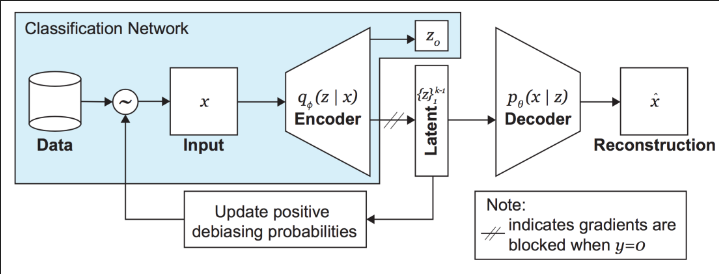

# Deep Learning CheatSheet

The following summary is inspired by: [https://www.globalsqa.com/deep-learning-cheat-sheet/](Deep Learning CheatSheet)

## 1. Introduction

Deep Learning is a subset of machine learning that uses artificial neural networks (Current state of the art) to solve problems. The two main benefits are:

1. Automatic feature extraction: Unlike traditional machine learning techniques (Input -> Feature Extraction -> Algorithm -> Output), it removes the need of manual feature extraction/engineering.
2. Non-Linearity


## 2. Training Neural Networks

### 2.1 Main Training Algorithm

Training a neural network follows a generic algorithm that can be adapted depending on the specific paradigm (e.g., supervised learning, reinforcement learning, self-supervised learning). The general baseline algorithm consists of:

1. **Forward Propagation**: Compute the predictions based on the current model (f) parameters.  
   $$
   \hat{Y} = f(WX + b)
   $$

2. **Loss Calculation**: Compare predictions with the ground truth using a loss function.  
   $$
   \mathcal{L} = \text{Loss}(Y, \hat{Y})
   $$

3. **Backward Propagation**: Compute gradients of the loss with respect to the model parameters.  
   $$
   \frac{\partial \mathcal{L}}{\partial W} ; \quad \frac{\partial \mathcal{L}}{\partial b}
   $$

4. **Optimization Step**: Update model parameters using an optimizer (e.g., SGD, Adam).  
   $$
   W \leftarrow W - \eta \frac{\partial \mathcal{L}}{\partial W}, \quad 
   b \leftarrow b - \eta \frac{\partial \mathcal{L}}{\partial b}
   $$

5. **Repeat** for multiple epochs until convergence.


### 2.2 Regularization

Regularization techniques prevent overfitting and improve model generalization. Common techniques include:

- **L1/L2 Regularization**:
- **Dropout**:
- **Batch Normalization**:
- **Early Stopping**: 

### 2.3 Training Models in the Wild

Neural networks contain a large number of parameters that are updated through **backpropagation and optimization algorithms**. High-level deep learning frameworks like **TensorFlow** and **PyTorch** provide built-in methods such as `.fit()` (TensorFlow) or `.train()` (PyTorch), which abstract much of this process.

However, in real-world applications, we often need more control over the training loop, especially for **logging, custom loss computation, debugging, and model interpretability**. In these cases, training is performed manually using lower-level APIs.

#### **Example: Custom Training Loop in TensorFlow**
```python
model = tf.keras.Sequential([
    tf.keras.layers.Dense(128, activation='relu'),
    tf.keras.layers.Dense(10, activation='softmax')
])
optimizer = tf.keras.optimizers.Adam()
loss_fn = tf.keras.losses.SparseCategoricalCrossentropy()

# Custom training loop
for epoch in range(10):
    for batch_x, batch_y in dataset:  # Iterate through batches
        with tf.GradientTape() as tape:
            predictions = model(batch_x, training=True)
            loss = loss_fn(batch_y, predictions)

        gradients = tape.gradient(loss, model.trainable_variables)
        optimizer.apply_gradients(zip(gradients, model.trainable_variables))

    print(f"Epoch {epoch + 1}, Loss: {loss.numpy()}")

#SIMILARLY FOR PYTORCH

model = torch.nn.Sequential(
    torch.nn.Linear(784, 128),
    torch.nn.ReLU(),
    torch.nn.Linear(128, 10),
    torch.nn.Softmax(dim=1)
)
optimizer = torch.optim.Adam(model.parameters())
loss_fn = torch.nn.CrossEntropyLoss()

# Custom training loop
for epoch in range(10):
    for batch_x, batch_y in dataloader:
        optimizer.zero_grad()
        predictions = model(batch_x)
        loss = loss_fn(predictions, batch_y)
        loss.backward()
        optimizer.step()

    print(f"Epoch {epoch + 1}, Loss: {loss.item()}")


```

### 2.4 Transfer learning

#### 2.4.1 Fine-tuning

#### 2.4.2 Feature extraction

### 2.5 Multi-task Learning


## 3. Activation Functions

Activation functions are mathematical operations that determine the output of each neuron in a neural network. They introduce non-linearity to the model, allowing it to learn complex patterns. Here's a list of common activation functions:


## 4. Loss Functions

Loss/cost functions are mathematical operations that guide the purpose of the learning process of the network, given that the main aim of the training algorithm for neural networks is to minimize this loss function at any cost. Therefore, the weights of the neurons are conditioned by this choice. Some common examples of loss functions are:


### 4.1 Cross-Entropy Loss (CE)
Cross-entropy loss is commonly used for classification tasks. It measures the dissimilarity between the true label distribution and the predicted probability distribution. 
$$
\mathcal{L}_{\text{CE}} = - \sum_{i=1}^{N} y_i \log(\hat{y}_i)
$$
where $y_i$ is the true label and $\hat{y}_i$ is the predicted probability.

### 4.2 Binary Cross-Entropy Loss
For binary classification tasks, binary cross-entropy (also known as log loss) is commonly used and is a variation of Cross-Entropy that uses binary labels (0/1) instead of probabilities.
$$
\mathcal{L}_{\text{BCE}} = - \frac{1}{N} \sum_{i=1}^{N} \left[ y_i \log(\hat{y}_i) + (1 - y_i) \log(1 - \hat{y}_i) \right]
$$
where $y_i$ is the true binary label and $\hat{y}_i$ is the predicted probability.

### 4.3 Categorical Cross-Entropy Loss (CCE)
For multi-class classification tasks, categorical cross-entropy is used to calculate the loss, exactly the same as regular CE but applied to multiple classes. (from_logits=false)
$$
\mathcal{L}_{\text{CCE}} = - \sum_{i=1}^{N} y_i \log(\hat{y}_i)
$$
where $y_i$ is the one-hot encoded true label, and $\hat{y}_i$ is the predicted probability for class \(i\).

### 4.4 Softmax Loss (for multi-class classification)
Softmax Loss is used in combination with the softmax activation function, and it is common for multi-class classification problems. It's just a variation of CCE that uses raw log-odds instead of probabilities.
$$
\mathcal{L}_{\text{Softmax}} = - \sum_{i=1}^{N} \log\left(\frac{e^{\hat{y}_i}}{\sum_{j=1}^{C} e^{\hat{y}_j}}\right)
$$
where $\hat{y}_i$ is the predicted score for class $i$ and $C$ is the total number of classes.

### 4.5 Mean Squared Error (MSE) 
Mean Squared Error is commonly used for regression tasks. It measures the average squared difference between the predicted and actual values.
$$
\mathcal{L}_{\text{MSE}} = \frac{1}{N} \sum_{i=1}^{N} (\hat{y}_i - y_i)^2
$$
where $\hat{y}_i$ is the predicted value and $y_i$ is the true value.

### 4.6 Mean Absolute Error (MAE)
MAE is another common loss function for regression tasks. It measures the average absolute difference between the predicted and actual values.
$$
\mathcal{L}_{\text{MAE}} = \frac{1}{N} \sum_{i=1}^{N} | \hat{y}_i - y_i |
$$
where $\hat{y}_i$ is the predicted value and $y_i$ is the true value.

### 4.7 Huber Loss
Huber Loss is a combination of MSE and Mean Absolute Error (MAE), providing robustness to outliers.
$$
\mathcal{L}_{\text{Huber}} = 
\begin{cases} 
\frac{1}{2} (y_i - \hat{y}_i)^2 & \text{for} \ |y_i - \hat{y}_i| \leq \delta \\
\delta (|y_i - \hat{y}_i| - \frac{1}{2} \delta) & \text{otherwise}
\end{cases}
$$
where $\delta$ is a threshold parameter that determines the transition between MSE and MAE.

### 4.8 Kullback-Leibler (KL) Divergence 
KL Divergence measures the difference between two probability distributions (prior p, posterior q), often used in Variational Autoencoders (VAEs) and other generative models.
$$
\mathcal{L}_{\text{KL}} = \sum_{i=1}^{N} p(x_i) \log\left(\frac{p(x_i)}{q(x_i)}\right)
$$
where $p(x_i)$ is the true distribution and $q(x_i)$ is the predicted distribution.

#### 4.8.1 Multivariate gaussian KL

For variational autoencoders where we use 2 normal distributions p(z) and q(z∣x), we want to encourage this q latent distributon to to be as close to p(z) as possible, to imitate this original distribution of the data.

$$
\mathcal{L}_{KL} = -\frac{1}{2} \sum_{j=1}^{d} \left( 1 + \log \sigma_j^2 - \mu_j^2 - \sigma_j^2 \right)
$$


### 4.9 Triplet Loss 
Triplet loss is used to learn an embedding space where the distance between similar samples is minimized and the distance between dissimilar samples is maximized. Used in image networks.
$$
\mathcal{L}_{\text{Triplet}} = \sum_{i=1}^{N} \left[\| f(x_i^a) - f(x_i^p) \|_2^2 - \| f(x_i^a) - f(x_i^n) \|_2^2 + \alpha \right]_+
$$
where $f(x)$ represents the embedding function, $x_i^a$ is the anchor, $x_i^p$ is the positive sample (similar to the anchor), and $x_i^n$ is the negative sample (dissimilar to the anchor), and $\alpha$ is the margin.

### 4.10 Contrastive Loss 
Contrastive Loss is used to train Siamese networks or models using contrastive learning, encouraging similar pairs to be closer and dissimilar pairs to be farther apart in the embedding space. Useful for siamese networks.
$$
\mathcal{L}_{\text{Contrastive}} = \frac{1}{2N} \sum_{i=1}^{N} y_i \| f(x_i^a) - f(x_i^b) \|_2^2 + (1 - y_i) \max(0, m - \| f(x_i^a) - f(x_i^b) \|_2)^2
$$
where \(y_i\) is a binary label indicating whether the pair \((x_i^a, x_i^b)\) is similar (\(y_i = 1\)) or dissimilar (\(y_i = 0\)), and \(m\) is a margin.


### 4.11 Focal Loss
Focal Loss is an extension of cross-entropy that down-weights easy examples and focuses more on hard examples. This is especially useful for dealing with class imbalance.
$$
\mathcal{L}_{\text{Focal}} = - \sum_{i=1}^{N} \alpha (1 - \hat{y}_i)^\gamma y_i \log(\hat{y}_i)
$$
where $\alpha$ is the balancing factor, $\gamma$ is the focusing parameter, and $y_i$ and $\hat{y}_i$ are the true label and predicted probability.

### 4.12 Hinge Loss (for support vector machines)
Hinge loss is commonly used for training Support Vector Machines (SVMs) and can also be used for classification tasks.
$$
\mathcal{L}_{\text{Hinge}} = \sum_{i=1}^{N} \max(0, 1 - y_i \cdot \hat{y}_i)
$$
where $y_i$ is the true label and $\hat{y}_i$ is the predicted value.

## 5. Optimizer algorithms

Optimizer algorithms are 

## 6. Evaluation Metrics

Evaluation metrics are used to gain a high-level intuition of how the model is performing, given that loss values, AIC/BIC don't explain the performance of the model in its task (Classification, Regression...)

## 7. Architectures
 
### 7.1 Feed-Forward Neural Network (FNN or MLP)

**Multi-Layer Perceptrons (MLPs)** are the foundation of deep learning models. These networks are composed of multiple layers of interconnected perceptrons, where each perceptron is a computational unit that performs a weighted sum of the input, applies an activation function, and passes the result to the next layer.

An MLP consists of:

- **Input Layer**: Accepts the input features.
- **Hidden Layers**: Contain perceptrons that learn complex patterns and transformations. Usually named *fully-connected/Dense layers*
- **Output Layer**: Produces the final output, typically with an activation function like **Sigmoid** (for binary classification) or **Softmax** (for multi-class classification).

**Activation functions** like **ReLU**, **Sigmoid**, and **Tanh** are used to introduce **non-linearity** into the network, allowing MLPs to model more complex relationships compared to linear models. An MLP without activation functions can be proven to be equivalent to a composition of linear models, which are a linear model. This estimators do not need any special assumption of the data or the model like linear or generalized linear models:

$$
\hat{y} = 𝑓(w_1\cdot x_1 + w_2\cdot x_2 + ... + 𝑏) \implies \text{Dense Layer, f is the activation function}
$$

$$
\hat{y} = w_1\cdot x_1 + w_2\cdot x_2 + ... + 𝑏 \implies \text{Linear Model}
$$

#### Example: Simple MLP for Binary Classification

Consider an MLP with 2 input neurons, 2 hidden neurons (hidden layer), and 1 output neuron (final layer).

#### 1. **Input Vector**
$$
\mathbf{x} = \begin{bmatrix} x_1 \\ x_2 \end{bmatrix} = \begin{bmatrix} 0.5 \\ 0.8 \end{bmatrix}
$$

#### 2. **Hidden Layer**
Weights and biases:
$$
W_1 = \begin{bmatrix} 0.4 & -0.6 \\ 0.7 & 0.1 \end{bmatrix}, \quad \mathbf{b}_1 = \begin{bmatrix} 0.1 \\ -0.2 \end{bmatrix}
$$

Hidden layer output:
$$
\mathbf{z}_1 = W_1 \cdot \mathbf{x} + \mathbf{b}_1 = \begin{bmatrix} -0.18 \\ 0.23 \end{bmatrix}
$$

Activation (ReLU):
$$
\mathbf{h} = \max(0, \mathbf{z}_1) = \begin{bmatrix} 0 \\ 0.23 \end{bmatrix}
$$

#### 3. **Output Layer**
Weights and bias:
$$
W_2 = \begin{bmatrix} 0.9 & -0.3 \end{bmatrix}, \quad b_3 = 0.05
$$

Output:
$$
z_2 = W_2 \cdot \mathbf{h} + b_3 = -0.019
$$

Activation (Sigmoid):
$$
\hat{y} = \sigma(z_2) = \frac{1}{1 + e^{0.019}} \approx 0.495
$$


**MLP Hyperparameters** are the following, among the most important ones:

1. Number of perceptrons/units
2. Activation function
3. Wheter to use bias or not and its initialization technique
4. Weight intialization technique
5. Regularization techniques

### 7.2 Recurrent Neural Network (RNN) 

### 7.2.1 Recurrent Unit (RNN)

### 7.2.2 Gated Recurrent Unit (GRU)

### 7.2.3 Long-Short Term Memory Unit (LTSM) 


### 7.3 Convolutional networks

1. These networks make use of the **convolution** operation for images: combine two functions to produce a third function. The convolution is used to extract features from an input image **F** using a filter/kernel **K**. Each filter extracts a feature-map, which is the result of the convolution operation and represents a smaller-processed image. **(if the filter is 2x2 and the image 64x64, then the feature-map of that convolution size is (64-2+1) * (64-2+1) = 63x63)**

 For a single-channel image with just 1 filter: 
$$  Y(i,j) = Convolution = (F * K)(i,j) = \sum_m \sum_n  F(i+m, j+n) * K(m,n) + b$$


For colors with images (2 dimensions and color channel) and multiple filters, the learning process would approximate the filters weights and the bias terms associated with each filter.

$$
    Y(i,j,k) = Convolution = (F * K)(i,j, k) =  \sum_m \sum_n \sum_c F(i+m, j+n, c) * K(m,n,c,k) + b_k
$$

**This equation represents sliding a filter across the input image, multiplying element-wise, summing up, and adding bias.**

After performing convolution, an activation function layer (ReLU / tanh) is followed to introduce non-linearity in the feature-map (given that convolutions are linear operations):

$$ Z(i,j,k)=max(0,Y(i,j,k)) $$

The bigger the number of filters (32, 64, 128...) the more low level features we can capture in the images such as edges, textures, diagonals... and other visual patterns. If this convolutional layer contains 32 filters, then it has 32 * 3 (i)* 3 (j) * 3 (c) = 864 learnable parameters. In addition 32 bias terms , one for each filter.


2. **Stride** controls how much the filter moves in each step horizontally and vertically. A stride of 1 means the filter moves pixel by pixel, while a stride of 2 skips every other pixel, reducing spatial dimensions.

3. **Padding** Padding helps control the output size of the feature map. "Valid" padding applies no extra pixels, shrinking the output feature-map, while "Same" padding (zero-padding) preserves the input size by adding zeros around the border.

4. **Pooling** layers are used to reduce the dimensionality of feature-maps and speed-up computations after the activation function. Pooling can be done through Max, Min, Avg and global pooling that reduces the whole feature-map to 1 value.

5. **Flatten** layers are used to transform tensors to simple vectors that can be processed by fully connected layers.


The hyperparameters of convolutional layers are:

1. Number of filters
2. Stride
3. Activation function

#### 7.3.1 Convolutional Neural Network (CNN)

Convolutional Neural Networks (CNNs) are widely used in computer vision tasks, such as image classification. For example, ResNet and VGG architectures have been successfully applied to large-scale datasets like ImageNet, where they classify images into thousands of categories with high accuracy. These models extract hierarchical features—starting with edges and textures in early layers and progressing to complex objects in deeper layers—making them powerful for real-world applications like autonomous vehicles, medical diagnosis, and facial recognition. Therefore they are often mixed with other architechture such as MLP or RNN to cover such use-cases.

Example of a simple CNN architechture (High-level process below with Backpropagation) operations performed by hand (Forward and Backward propagations), processing a greyscale input image X for a binary classification task:

- 1️⃣ Convolution (2×2 only 1 filter) → Feature detection
- 2️⃣ ReLU Activation → Introduces non-linearity
- 3️⃣ Pooling (2×2 max pooling) → Reduces dimensions
- 4️⃣ Flatten → Converts feature maps into a unidimensional vector 
- 5️⃣ Fully connected layer → Classification and decision-making 
- 6️⃣ Softmax → Converts output into class probabilities
- 7️⃣ Backpropagation → Updates weights to minimize loss

Given this network N and image X, the result of $N(X) = \{0.31, 0.69\}$, therefore the image X belongs with higher probability to class 2. Below all the process is described:

$$
X =
\begin{bmatrix}
1 & 2 & 3 & 0 \\
4 & 5 & 6 & 1 \\
7 & 8 & 9 & 2 \\
0 & 1 & 2 & 3
\end{bmatrix}
$$
The X image is 4x4 and only 1 filter of 2x2 is used with bias, therefore padding isn't needed
$$
K =
\begin{bmatrix}
1 & 0 \\
-1 & 2
\end{bmatrix}
,  b = 0
$$

$$
Y_{\text{conv}}(i,j) =
\begin{bmatrix}
(1 \times 1) + (2 \times 0) + (4 \times -1) + (5 \times 2) + 0 & (2 \times 1) + (3 \times 0) + (5 \times -1) + (6 \times 2) + 0 & \dots \\
(4 \times 1) + (5 \times 0) + (7 \times -1) + (8 \times 2) + 0 & (5 \times 1) + (6 \times 0) + (8 \times -1) + (9 \times 2) + 0 & \dots \\
\dots & \dots & \dots
\end{bmatrix}
$$

Applying the convolution operation yields the following feature map


$$
Y_{\text{conv}}(i,j) =
\begin{bmatrix}
7 & 9 & 8 \\
10 & 12 & 11 \\
5 & 6 & 7
\end{bmatrix}
$$

Now an activation function such as ReLU is applied to introduce non-linearity to the convolution.
$$
Z_(i, j) = \max(0, Y_{\text{conv}}(i, j))
$$

$$
Z(i,j) =
\begin{bmatrix}
7 & 9 & 8 \\
10 & 12 & 11 \\
5 & 6 & 7
\end{bmatrix}
$$
To reduce dimensionality of the feature-map, max-pooling 2x2 is applied:
$$
V_{\text{pool}}(i,j) =
\begin{bmatrix}
\max(7, 9, 10, 12) & \max(9, 8, 12, 11) \\
\max(10, 12, 5, 6) & \max(12, 11, 6, 7)
\end{bmatrix}
$$

$$
V_{\text{pool}} =
\begin{bmatrix}
12 & 12 \\
12 & 12
\end{bmatrix}
$$
Before using the fully connected MLP layer, we need to perform vectorization of the matrix $W_{pool}$, Flattening
$$
V_{Flattened} = [12, 12, 12, 12]
$$

Finally,the output feature-map of the CNN is ingested by the fully connected-layer (2 perceptrons) which performs a regular linear feed-forward operation that outputs 2 log-odds numbers. This is the pre-activation function $Z = W \cdot X + b$

$$
\begin{bmatrix}
w_1 & w_2 & w_3 & w_4 \\
w_5 & w_6 & w_7 & w_8
\end{bmatrix}
\cdot
\begin{bmatrix}
12 \\
12 \\
12 \\
12
\end{bmatrix}
+
\begin{bmatrix}
b_1 \\
b_2
\end{bmatrix}
=
\begin{bmatrix}
z_1 \\
z_2
\end{bmatrix}
$$

$$
z_1 = (0.1 \times 12) + (0.2 \times 12) + (-0.1 \times 12) + (0.05 \times 12) + 0.5 = 3.5
$$

$$
z_2 = (-0.3 \times 12) + (0.2 \times 12) + (0.4 \times 12) + (0.1 \times 12) - 0.5 = 4.3
$$

After the fully-connected layer, the activation function **softmax** is used to change the scale of the log-odds to probabilities

$$
P_1 = \frac{e^{3.5}}{e^{3.5} + e^{4.3}} = \frac{33.1}{33.1 + 73.4} = 0.31
$$

$$
P_2 = \frac{e^{4.3}}{e^{3.5} + e^{4.3}} = \frac{73.4}{33.1 + 73.4} = 0.69
$$

After performing forward propagation, loss must be computed and weight update if we are actively training the network and not just infering:
$$
W_{\text{new}} = W_{\text{old}} - \eta \frac{\partial \text{Loss}}{\partial W}
$$

#### 7.3.2 Capsule Networks (CapsNets)

Capsule Networks (CapsNets) are an advanced neural network architecture designed to address limitations in traditional Convolutional Neural Networks (CNNs), particularly in handling spatial hierarchies and viewpoint variations. Unlike CNNs, which rely on max-pooling for dimensionality reduction, CapsNets use **capsules**, which encode both **features** and their **spatial relationships**.


CapsNets replace the standard CNN layers with a **capsule-based structure**, which consists of:

1. **Convolutional Layer:** Extracts low-level features, similar to CNNs.
2. **Primary Capsules Layer:** Groups convolutional features into small vector capsules.
3. **Higher-Level Capsules (DigitCaps):** Captures spatial relationships between features using **dynamic routing**.
4. **Reconstruction Network:** Uses a **decoder** to reconstruct the input image, aiding in interpretability.

---

#### Step-by-Step Architecture of CapsNet

##### **1. Input Layer**
- Takes in a **grayscale image** (e.g., MNIST 28×28).
- The image is **normalized** before being passed into the network.

##### **2. Convolutional Layer**
- A **standard convolutional layer** extracts **basic features** like edges and textures.
- Uses **ReLU activation** to introduce non-linearity.
- Example:
  - **256 filters** of **9×9** kernel applied with **stride 1**.

**Conv Output Shape:** `(20 × 20 × 256)`

---

##### **3. Primary Capsules Layer**
- Instead of scalars, features are now grouped into **capsules** (small vector groups).
- Each capsule represents a **part of an object** and encodes **both presence & orientation**.
- Implemented using **convolutional capsules** (each acting as a mini-network).
- Example:
  - **32 capsule groups**
  - **Each capsule = 8D vector**
  - **Kernel size: 9×9, Stride: 2**
  - Output: **(6 × 6 × 32 capsules) → Reshaped to (1152 capsules × 8D)**

**Capsule Output Shape:** `(1152, 8)`

---

##### **4. Digit Capsules (Higher-Level Capsules)**
- Each **higher-level capsule** represents **a whole object**, such as a digit in MNIST.
- Uses **dynamic routing** (instead of max-pooling) to determine **which lower capsules send their output**.
- Example:
  - **10 capsules (one per digit)**
  - Each capsule outputs a **16D vector**
  - **Routing Algorithm:** **Squash Function** ensures outputs are **unit-length vectors**

**DigitCaps Output Shape:** `(10, 16)`

---

##### **5. Capsule Routing Mechanism**
- Unlike CNNs, where signals flow in a fixed way, **CapsNets use routing-by-agreement**:
  1. **Low-level capsules predict higher-level capsules' output.**
  2. **Capsules compare agreement (dot product similarity).**
  3. **High-agreement capsules strengthen their connection.**
  4. **Squash activation ensures output is within unit-length.**

$v_j = \frac{||s_j||^2}{1 + ||s_j||^2} \cdot \frac{s_j}{||s_j||}$


---

##### **6. Decoder (Reconstruction Network)**
- To **enhance learning**, CapsNets include a **decoder** that reconstructs the original input.
- The decoder is a **small MLP with three fully connected layers**:
  1. **First layer**: 512 neurons
  2. **Second layer**: 1024 neurons
  3. **Output layer**: Reshaped into an **image (28×28 pixels for MNIST)**

**Decoder Output:** `(28, 28)`

---

| **Layer**            | **Type**  | **Details**  |
|----------------------|----------|-------------|
| **Input**           | Image    | `28×28` (MNIST) |
| **Conv Layer**      | CNN      | `9×9` kernel, 256 filters |
| **Primary Capsules** | Capsules | 32 capsules, 8D vectors |
| **Digit Capsules**  | Capsules | 10 capsules, 16D vectors |
| **Decoder**        | MLP      | Reconstructs the image |

---


### 7.4 Generative Networks

#### 7.4.1 Autoencoders (AE)

An **Autoencoder (AE)** is a type of neural network designed to learn a compressed representation (encoding) of data using an encoder network and then reconstruct it back to its original form through a decoder. It is an unsupervised learning model that aims to minimize the difference between the input and output. Autoencoders are mainly used for **dimensionality reduction, denoising, anomaly detection...**

An AE consists of two main parts:

1. **Encoder**: Maps input $x$ to a lower-dimensional latent space $z$.
2. **Decoder**: Reconstructs $ x'$ from $z$, aiming to make $$ x' \approx x $$.

Mathematically, an AE is defined as:
$$
    z = f_\theta(x) \quad \text{(Encoder)}
$$
$$
    x' = g_\phi(z) \quad \text{(Decoder)}
$$
where $f_\theta$ and $g_\phi$ are neural networks with learnable parameters $\theta$ and $\phi$ respectively.

The model is trained by minimizing the reconstruction loss, typically the **Mean Squared Error (MSE)**:
$$
    \mathcal{L}_{AE} = \| x - x' \|^2
$$

However, standard AEs do not impose any constraints on the latent space $z $, which can lead to poor generative capabilities. Example in pytorch:

``` python
class Autoencoder(nn.Module):
    def __init__(self):
        super(Autoencoder, self).__init__()
        self.encoder = nn.Sequential(
            nn.Linear(784, 128),
            nn.ReLU()
        )
        self.decoder = nn.Sequential(
            nn.Linear(128, 784),
            nn.Sigmoid()
        )

    def forward(self, x):
        z = self.encoder(x)
        x_reconstructed = self.decoder(z)
        return x_reconstructed
```

---


#### 7.4.2 Variational Autoencoders (VAE)

A **Variational Autoencoder (VAE)** is an extension of AE that makes the latent space continuous and structured, which improves its generative power. Instead of mapping inputs to a single point $z$, the encoder models them as a **probability distribution** $q_\phi(z|x)$, distribution of latent space $z$ given input data $x$.

1. **Latent Representation as a Distribution**
   - Instead of learning a deterministic encoding $z$, VAE learns the parameters: mean $\mu $ and variance $\sigma^2$ of a Gaussian distribution for example:
   $$
       \mu, \log \sigma^2 = f_\theta(x)
   $$
   $$
       z \sim \mathcal{N}(\mu, \sigma^2 I)
   $$

2. **Reparametrization Trick**
   - To allow backpropagation easily due to the computation graph generated by this random component, we sample $z$ as:
   $$
       z = \mu + \sigma \cdot \epsilon, \quad \epsilon \sim \mathcal{N}(0, I)
   $$

3. **VAE Loss Function**
   - VAE is trained using two losses:
     1. **Reconstruction Loss** (like AE): Ensures $x'$ is close to $x$.
     2. **Kullback-Leibler (KL) Divergence**: Encourages $q_\phi(z|x)$ to be close to a standard Gaussian $ p(z) = \mathcal{N}(0, I) $:
   $$
       \mathcal{L}_{VAE} = \mathbb{E}[\| x - x' \|^2] + \beta \cdot D_{KL}(q_\phi(z|x) \| p(z))
   $$

   - The KL divergence loss term **regularizes** the latent space, ensuring smooth interpolation/continous space and generative capabilities.

An example in pytorch would be:

```python
class VAE(nn.Module):
    def __init__(self):
        super(VAE, self).__init__()
        self.encoder = nn.Sequential(
            nn.Linear(784, 128),
            nn.ReLU()
        )
        self.fc_mu = nn.Linear(128, 20)
        self.fc_logvar = nn.Linear(128, 20)
        self.decoder = nn.Sequential(
            nn.Linear(20, 128),
            nn.ReLU(),
            nn.Linear(128, 784),
            nn.Sigmoid()
        )

    def reparameterize(self, mu, logvar):
        std = torch.exp(0.5*logvar)
        eps = torch.randn_like(std)
        return mu + eps*std

    def forward(self, x):
        h = self.encoder(x)
        mu, logvar = self.fc_mu(h), self.fc_logvar(h)
        z = self.reparameterize(mu, logvar)
        x_reconstructed = self.decoder(z)
        return x_reconstructed, mu, logvar

```
Note: Tabular data would work just fine using linear layers, however multiple dimensions data like images would definetely work better using Conv2DTranspose, which performs the inverse operation of convolution. 

---

**DeBiasing Variational Autoencoder (DB-VAE)** is a variant of the **Variational Autoencoder (VAE)** designed to **identify and mitigate biases** in classification tasks. It enhances learning for underrepresented classes by selectively applying VAE regularization. Therefore this VAE is only used for debiasing.

The main idea is that for well-represented individuals, just an ordinary classifier network is enough. However, for biased/underrepresented individuals, VAE is used for forcing a better feature learning. 

### **Key Differences from Standard VAEs**  

1. **Classification-Aware Learning:**  
   - Unlike standard VAEs, DB-VAE includes a **classification loss** to train a classifier alongside the encoder-decoder structure.  

2. **Selective VAE Regularization:**  
   - A special **indicator function** $ I_f(y) $ is used to apply **VAE loss** only to specific samples, typically those from underrepresented or difficult classes.  

### **Loss Function**  

The total objective function is:  

$$
L_{\text{total}} = L_y(y, \hat{y}) + I_f(y) L_{\text{VAE}}
$$  

Where:  
- $ L_y(y, \hat{y}) $: Cross-entropy loss for classification.  
- $ L_{\text{VAE}} $: Standard VAE loss (reconstruction + KL divergence).  
- $ I_f(y) $: Indicator function that applies VAE loss selectively to the underrepresented/biased individuals. For example: native-american $\implies I_f(y) = 1$. This function can be easily express with categorical variables or low confidence thresholds for example.


**AUTOMATIC DEBIASING:** adaptative resampling underrepresented data points based on their distribution in the latent space. During training, the encoder estimates the latent distribution \( Q(z|X) \), and a histogram is created for each latent dimension to identify **rare samples**. The sampling probability of each data point is then adjusted by **inverting the density function**, ensuring that **low-frequency samples are selected more often**. This approach **balances the dataset without needing explicit bias labels**, making the model more fair and generalizable.


This balances the classes, reduces bias, improves representation and serves for generalization purposes. The model architechture is to use a classification network for encoding, and a separate decoder network for decoding:




#### 7.4.3 Generative Adversarial Networks (GAN)

#### 7.4.4 Difusion Model 

#### 7.4.5 Deep Belief Networks


### 7.5 Transformers

#### 7.5.1 Attention

#### 7.5.2 Transformer


### 7.6 Graph Models

#### 7.6.1 Graph Neural Networks (GNN)

#### 7.6.2 Graph Convolutional Networks (GCN)

#### 7.6.3 Graph Attention Networks (GAT)


### 7.7 Hybrid Models 

#### 7.7.1 Neural Architecture Search (NAS)

#### 7.7.2 Memory augmented neural networks (MANN)

#### 7.7.3 Neural Ordinary Differential Equations (ODE)

#### 7.7.4 Multi-modal Models


### 7.8 Reinforcement Models

#### 7.8.1 Deep-Q Networks (DQN)

#### 7.8.2 Actor Critic 


### 7.9 Self-Organizing Maps

### 7.10 Self Supervised Learning


 
## 8. Other important Deep Learning Concepts

### 8.1 Few-Shot and Zero-Shot

### 8.2 Mixture of Experts (MoE)

### 8.3 Retrieval Augmented Generation (RAG)

### 8.4 CAG


## 9. Explainability and Interpretability

### 9.1 SHAP 

### 9.2 LIME

### 9.3 Attention VIZ


## 10 Deep Learning Hardware & Compilation

### 10.1 Hardware

### 10.2 Compilation

### 10.3 Compression


## 11 Limitations of Deep Learning

### 11.1 Rethinking generalization

Even if you randomized train data, you can always get a NN that gets a high train accuracy, with shitty test accuracy

They are excellent function approximators if enough training data, but highly uncertain for unseen data

### 11.2 Training data importance

GIGO 

Bias of seen data is huge, given that neural networks and approximators are just basically compression of the data seen.


HUMAN INTENTION IS TO USE LANGUAGE AS A TOOL TO SPEAK ROBOTEESE. TO EASILY USE MACHINES.

### 11.3 Human Bias

Due to our inherent nature / life experience, every single one of us has some form of **bias $b$** towards some outcome. For example, if we all try to imagine shoes, some of us have a natural inclination towards AMONG US AIR JORDANS and others towards red heels, and justifying the why is extremely difficult. There are 3 main types of common biases:

**Interaction biases**: Input data given by user (Not the developer) is biased, for instance end-users draw more AIR JORDAN that heels in a MNIST-like classifier which is re-trained with end-user data.

**latent biases**: If you train a model with images of psyhicians you get a skewed-model towards men for example, given that there is a sex imbalance in the field, so the bias is latent.

**selection biases**: Given the huge amounts of data available in the world, our subset data can be biased towards certain races, sexes, features, colors or shapes if we aren't careful about having variety in the data. Besides the political and ethical stuff, the lack of this bias helps models to generalize better.


An easy way to assess a biased model (classifier for example) is if this model changes drastically after it sees some aditional latent features / examples. This causes worse/different precision on classification tasks for this new kind of observation. Companies often will label their data to manually mitigate the bias and balance the dataset, however this task is sisyphean depending on the size of the data. However, Variational AutoEncoders can greatly help in determining the latent space $z$


## MISC
### PyTorch Hierarchy of Modules

- **PyTorch**
  - **torch** (Core library)
    - **torch.nn** (Neural network library)
      - **nn.Module** (Base class for all neural network modules)
      - **nn.Linear** (Fully connected layer)
      - **nn.Conv2d** (2D Convolutional layer)
      - **nn.LSTM** (Long Short-Term Memory layer)
      - **nn.ReLU** (ReLU activation function)
    - **torch.optim** (Optimization algorithms)
      - **optim.SGD** (Stochastic Gradient Descent)
      - **optim.Adam** (Adam optimizer)
    - **torch.autograd** (Automatic differentiation)
      - **Variable** (Wrapper for tensor with gradients)
      - **grad** (Gradient computation)
    - **torch.utils** (Utility functions)
      - **DataLoader** (Data batching and loading)
    - **torch.cuda** (GPU operations)
      - **Tensor.cuda()** (Move tensor to GPU)
      - **torch.nn.DataParallel** (Parallelism across multiple GPUs)

  - **torchvision**
    - **models** (Pretrained models like ResNet, VGG)
    - **datasets** (CIFAR-10, COCO, etc.)
    - **transforms** (Data preprocessing and augmentation)

  - **torchaudio**
  - **torchtext**

